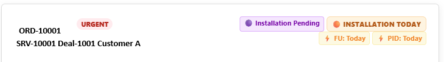
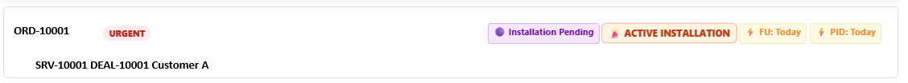
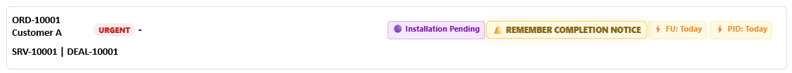
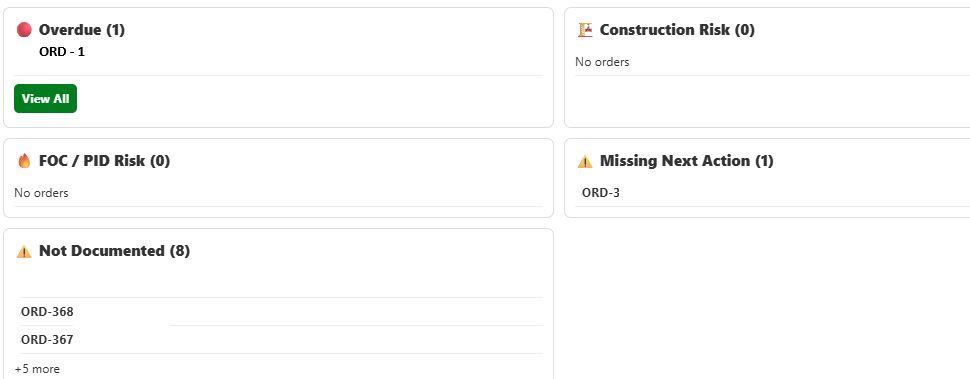

# Operations Workflow Dashboard

Operational workflow dashboard focused on risk reduction, follow-up management, installation monitoring and reporting.

## Key Capabilities

- Review Type Management
- Installation Monitoring Engine
- Completion Notice Reminder System
- Operational Risk Dashboard
- Follow-Up Tracking
- CSV Backup & Restore
- Workflow Checklists
- Reporting Tools
  
## Features

✅ Task Tracking

✅ Installation Monitoring

✅ Completion Notice Reminders

✅ Risk Indicators

✅ Priority Controls

✅ Follow-Up Management

✅ CSV Import / Export

✅ Reporting Tools

---

## Screenshots

### Main Dashboard

### Installation Monitoring

### Completion Reminder

### Control Center

---

## Technologies

- JavaScript
- HTML
- CSS
- Local Storage
- Tampermonkey

---

## Project Goal

This project was created to help manage operational workflows,
follow-ups, milestones and documentation through a centralized dashboard.

The solution focuses on improving visibility, reducing operational risk
and supporting workflow execution through reminders, status indicators
and reporting tools.

## Project Evolution

v1 – Order Tracking

v3 – Workflow Checklists

v5 – Reporting

v7 – Review Types

v9 – Installation Monitoring

v9.37 – Completion Notice Reminder Engine
